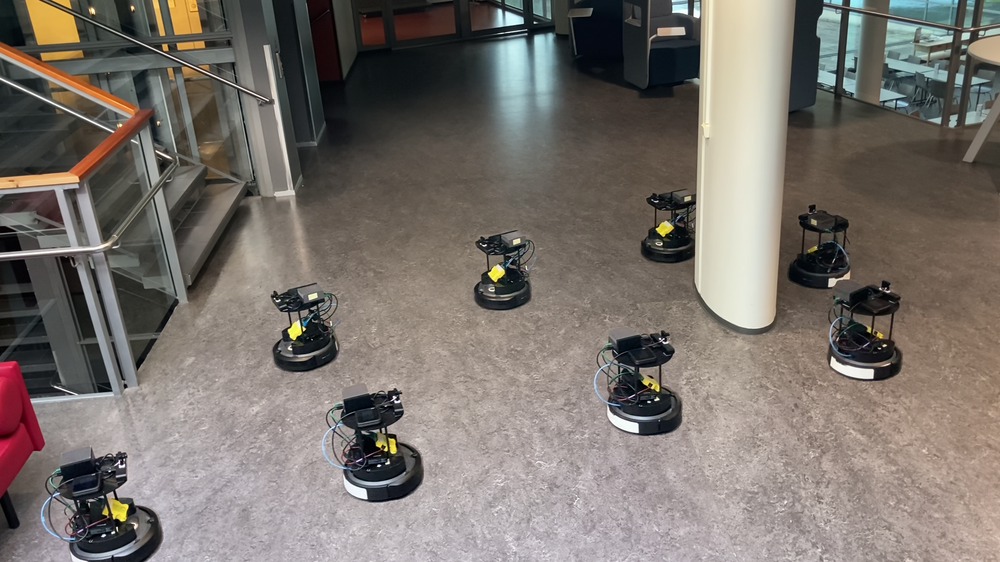
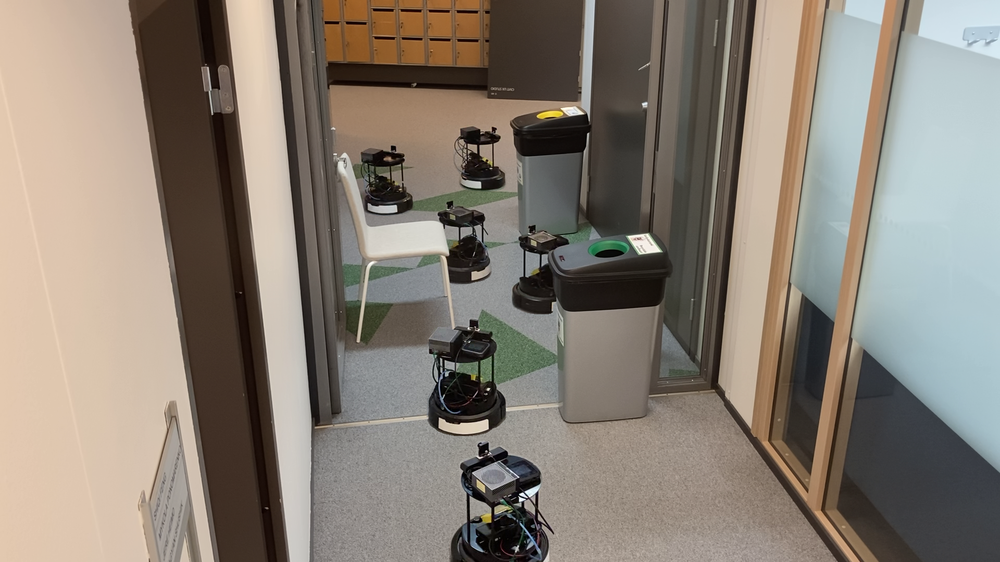
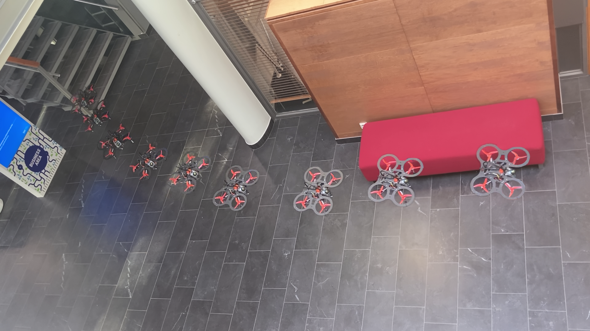

<div align="center">
<h1>Synthetic vs. Real Training Data for Visual Navigation</h1>
  
[**Lauri Suomela**](https://lasuomela.github.io/)<sup>&dagger;</sup> · [**Sasanka Kuruppu Arachchige**](https://github.com/SasaKuruppuarachchi) · [**German F. Torres**](https://germanftv.github.io/)  
[**Harry Edelman**](https://www.linkedin.com/in/harryedelman/) · [**Joni-Kristian Kämäräinen**](https://scholar.google.fi/citations?user=r6Y4nacAAAAJ&hl=fi)
<br>
<i>Computer Vision Group, Tampere University</i>
<br>
&dagger;Corresponding author

<a href=""></a>
<a href='https://lasuomela.github.io/faint/'></a>
<a href='https://huggingface.co/collections/lauriasuo/faint-67b71dbaf71f1b648986f382'></a>
</div>

</div>

This repository presents code to train and deploy <b>F</b>ast <b>A</b>ppearance-<b>I</b>nvariant <b>N</b>avigation <b>T</b>ransformer, <b>FAINT</b>, used in the experiments of the associated paper. FAINT is a learning-based navigation policy that can be trained entirely in simulation, and transferred zero-shot to run onboard a real robot. It generalizes across diverse environment conditions despite operating on RGB images only.

<p align="center">
  
   
  
</p>

## Deployment

### Hardware requirements

- A robot with ROS2 interface for `Twist` velocity commands. The FAINT models have been tested on a Turtlebot4 and a custom drone.
- A (companion) computer with Linux OS. FAINT has been tested on Jetson Orin AGX & NX machines.
- An RGB camera with ROS2 a driver. We utilized a ZED 2i camera with the ZED ROS2 wrapper, and a generic 110° HFOV USB camera with the `usb_cam` ROS2 driver.

### Software setup

<details><summary><b><font size="+3">Local install</font></b></summary><br/>

FAINT has minimal deployment dependencies.

1. Make sure you have ROS2 Humble, Pytorch (>=2.2) and Torchvision installed in your local environment.
2. Install dependencies (if missing) with `pip install -r faint/deployment/requirements.txt`
3. If you want to use NoMAD, run `pip install -e "git+https://github.com/real-stanford/diffusion_policy.git@main#egg=diffusion_policy"`
4. Install the Faint package with `pip install -e .`
5. Navigate to `faint/deployment/src` and build the ROS package with `colcon build`. Source the package.

</details>

<details><summary><b><font size="+3">Docker</font></b></summary><br/>
  
For ease of deployment, we provide a Docker image that includes the FAINT package and necessary dependencies.

1. Make sure you have installed [Docker](https://docs.docker.com/engine/install/), [Docker Compose](https://docs.docker.com/compose/) and [NVIDIA Container toolkit](https://docs.nvidia.com/datacenter/cloud-native/container-toolkit/latest/install-guide.html).
2. Navigate to `docker/jetson` or `docker/pc` depending on your platform.
3. Build the Docker image with `./build.sh`. For Jetson, we also provide scripts to build a Docker image for running camera drivers for generic USB cameras and Zed cameras.
4. Run the container `./up.sh -c <camera_name>`. This will launch the FAINT container, and a separate container for the camera `<camera_name>`. Make sure there is an entry for `<camera_name>` in `docker-compose.yml`. Alternatively, you can set `<camera_name>` to blank, and run the camera ROS driver in your local environment.
5. You should now enter the FAINT container, with [Foxglove bridge](https://docs.foxglove.dev/docs/connecting-to-data/ros-foxglove-bridge) running in the background. You can visualize the camera and other topics with Foxglove.

</details>

#### Pretrained models

The pretrained weights for the FAINT and place recognition models are automatically downloaded when running the deployment software for the first time. If you want to use GNM/ViNT/NoMAD, download the checkpoints and place them under `faint/deployment/src/faint_deployment/model_weights` following the instructions from the authors' [repo](https://github.com/robodhruv/visualnav-transformer).

#### Parameter configuration

- `faint/deployment/src/faint_deployment/config/robots.yaml`: Make sure there is an entry for your robot and camera.
- `faint/deployment/src/faint_deployment/config/models.yaml`: Lists the models you can use.
- `faint/deployment/src/faint_deployment/config/usb_cam.yaml`: If using the `usb_cam` driver from the provided Docker image, you can modify the parameters here.
- `faint/deployment/src/faint_deployment/config/zed2i.yaml`: If using the ZED ROS2 driver from the provided Docker image, you can modify the parameters here.

### Run

1. Make sure your camera ROS driver is running. Running in a Docker container with `./up.sh -c <camera_name>` takes care of this automatically.
2. First execute
```bash
cd faint/deployment
./record_bag.sh <bag_name>
```
and teleoperate the robot along a route to collect images for the topological map.

3. Create the topological map using
```bash
ros2 launch faint_deployment topomap_generator.launch.py bag_file:=<bag_name> route_name:=<route_name> dt:=<sampling_interval> robot:=<robot_name> camera_type:=<camera_name>
```
4. Launch the navigation policy with
 ```bash
 ros2 launch faint_deployment navigate.launch.py route_name:=<route_name> goal_reaching_policy:=<policy_name> robot:=<robot_name> camera_type:=<camera_name>
 ```
We recommend Foxglove for visualization.

<details><summary><font size="+3">Parameter definitions:</font></summary><br/>
  
```
<bag_name>:           Name of the bag to collect.
<route_name>:         Name of the image folder to create from the bag.
<sampling_interval>:  Density of the map; the time interval (s) between images sampled from the bag.        E.g.: 5.0
<robot_name>:         Must be present in faint/deployment/src/faint_deployment/config/robots.yaml.          E.g.: turtlebot4
<camera_name>:        The yaml entry for <robot_name> should have an entry for a camera with this name.     E.g.: zed2
<policy_name>:        A goal reaching policy from faint/deployment/src/faint_deployment/config/models.yaml. E.g.: FAINT-Sim
```
See `topomap_generator.launch.py` and `navigate.launch.py` in `faint/deployment/src/faint_deployment/launch` for a complete list of launch parameters.

</details>

## Train your own model

We provide code to train FAINT with data from the Habitat simulator using DAgger.
Training has been tested on a PC with Ubuntu 22.04, and in a HPC SLURM environment. Training requires Nvidia GPU(s), and takes ~24h when running on single node with 4 Tesla V100's.

### Software setup

In the repository's top folder

1. Set up the conda environment:
    ```bash
    conda env create -f faint/train/environment_py310.yml
    ```
2. Activate the training environment:
    ```bash
    conda activate habitat_py310
    ```
3. Install Theia and Faint packages:
    ```bash
    # Theia has to be installed without dependencies, so install it here
    pip install git+https://github.com/bdaiinstitute/theia.git@9ee7548829088e1a7dae6a033dfb6b520656c1f2 --no-deps
    pip install -e .
    ```

Download the [HM3D](https://github.com/facebookresearch/habitat-sim/blob/v0.3.0/DATASETS.md#habitat-matterport-3d-research-dataset-hm3d) scenes and [HM3D Point goal navigation](https://github.com/facebookresearch/habitat-lab/blob/v0.3.0/DATASETS.md#task-datasets) dataset, and place them under `data`.

### Train

Training is configured using Hydra, with the `.yaml` files in `faint/train/config/experiments/`. See `faint/train/config/default_structured_configs.py` for full list of configurable training parameters. They extend the parameter set of [Habitat-Lab](https://github.com/facebookresearch/habitat-lab/blob/v0.3.0/habitat-lab/habitat/config/default_structured_configs.py) and [Habitat-Baselines](https://github.com/facebookresearch/habitat-lab/blob/v0.3.0/habitat-baselines/habitat_baselines/config/default_structured_configs.py). See [Habitat-Lab](https://github.com/facebookresearch/habitat-lab/blob/v0.3.0/habitat-lab/habitat/config/README.md) and [Hydra docs](https://hydra.cc/docs/intro/) for detailed explanations on usage of Hydra with the Habitat simulator.

#### Local launch

We suggest launching training with `torchrun` which automatically configures the necessary environment variables for multi-GPU training.

To replicate FAINT training from the paper, run
```bash
torchrun --nnodes=1 --nproc-per-node=<NUM_GPUS> \
    -m faint.train.run \
    --config-name=experiments/main_experiment/FAINT_10x.yaml \
    habitat_baselines.il.trainer.num_devices=<NUM_GPUS> \
    habitat_baselines.il.trainer.num_nodes=1 \
    habitat_baselines.il.data_collection.scratch_dir=<DATA_SAVE_PATH>
```

Set `<NUM_GPUS>` and `<DATA_SAVE_PATH>` to appropriate values for your environment.

#### SLURM

On a HPC system, you can launch training without `torchrun` since SLURM should automatically set up the necessary environment variables for torch distributed, e.g. 

```bash
srun python -u \
    -m faint.train.run \
    --config-name=experiments/main_experiment/FAINT_10x.yaml \
    habitat_baselines.il.trainer.num_devices=$SLURM_GPUS_ON_NODE \
    habitat_baselines.il.trainer.num_nodes=$SLURM_JOB_NUM_NODES \
    habitat_baselines.il.data_collection.scratch_dir=dagger_examples/$SLURM_JOBID \
    habitat_baselines.il.data_collection.fast_tmp_dir=\$LOCAL_SCRATCH # Optional
```

If the environment has a fast temporary disk to use during the Slurm job, you can specify the path by overriding `habitat_baselines.il.data_collection.fast_tmp_dir`.

## Acknowledgements

Parts of this repo have been inspired by these awesome repositories:

[Imitation](https://github.com/HumanCompatibleAI/imitation) <br/>
[General Navigation Models](https://github.com/robodhruv/visualnav-transformer/tree/main) <br/>
[PlaceNav](https://github.com/lasuomela/PlaceNav) <br/>
[Habitat-Lab](https://github.com/facebookresearch/habitat-lab/tree/main) <br/>
[VLN-CE](https://github.com/jacobkrantz/VLN-CE/tree/master)

## Citation

If you find this project useful, please consider citing:

```bibtex
@article{suomela2025synthetic,
  title={Synthetic vs. Real Training Data for Visual Navigation},
  author={Suomela, Lauri and Kuruppu Arachchige, Sasanka and Torres, German F. and Edelman, Harry and Kämäräinen, Joni-Kristian}
  journal={arXiv:},
  year={2025}
}
```
